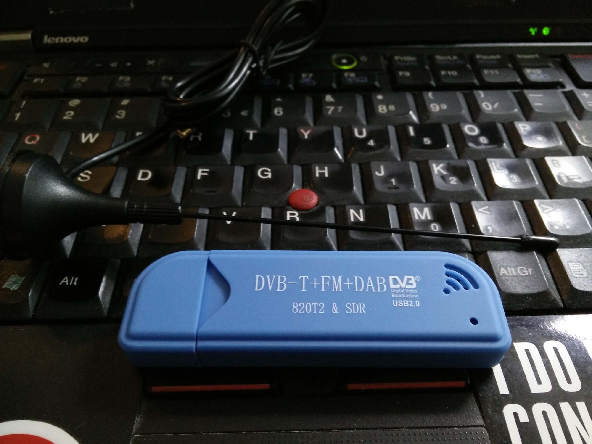
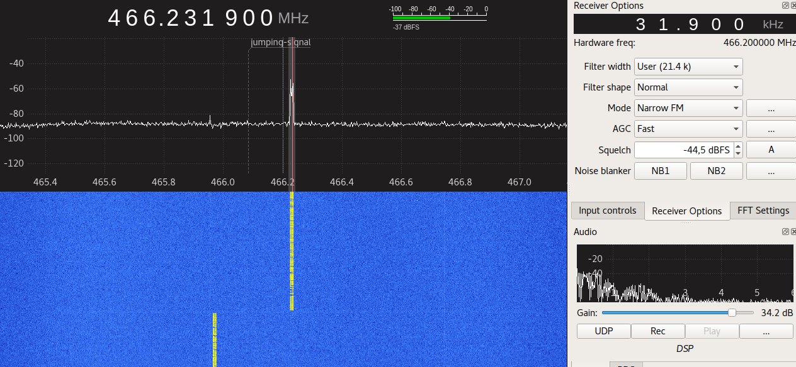
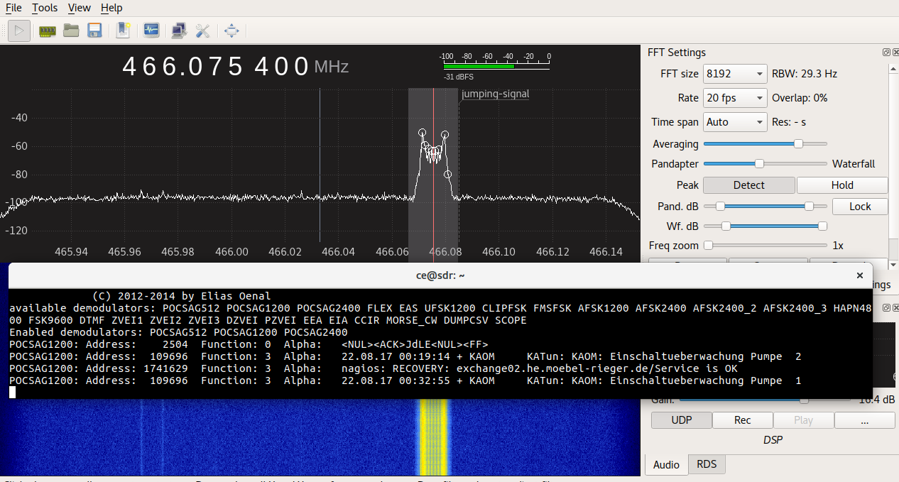
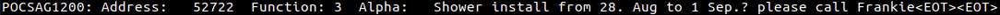

# Introduction

Few days ago I attended [Introduction to Software Defined Radio](https://criticalengineering.org/intensives/2017/radio), organized by [Julian](http://julianoliver.com/) and [Bengt](http://automata.se/) from [Critical Engineering](https://criticalengineering.org/).

The first day was quite exciting. Once I was home, I decided to explore the frequency spectrum to find something interesting.


# Much mysterious, very 466MHz, wow.

I found a really strong signal jumping periodically between 466.0768MHz, 466.2310MHz, 465.9707MHz. Some internet pages say that it is an [unidentified digital signal](http://www.sigidwiki.com/wiki/Unidentified_466_MHz_digital_signal). Even though I later discovered that it is a [known frequency](https://en.wikipedia.org/wiki/POCSAG#National_implementations) for pagers, for a total n00b like me reading *unidentified signal* tickled my curiosity **a lot**.


# Decoding the signal

## Prerequisites

### Hardware

I used the **RTL 820T2 SDR Dongle** that I got from the course, its tiny antenna is enough.



### Software

* [gqrx](http://gqrx.dk/) to receive the radio signal.
* [multimon-ng](https://github.com/EliasOenal/multimon-ng) to decode it.

### Put everything together

The steps to read the signal are the following:
1. Point `gqrx` to listen to the correct frequency, and output the signal as UDP packets
2. Start a UDP server and pipe it to a program to convert the stream from 48k to 22k.
3. Pipe the output of the converted audio stream to `multimon-ng`

Point your radio to 466.0916MHz, you should see a strong signal around that frequency.


After you find the exact frequency of the one you want to analyze, center your receiver to that frequency (we need this because later we will enable decimation, and decimation will reduce the range of the frequencies we see in the main panel). I have good results with frequency 466.075MHz.

I use the following settings:

* File > I/O Devices:
  * Decimation: 8

* **Input controls**:
  * LNA gain: 17db
  * DC Remove: on
  * IQ balance: on
  * Freq. correction: 58ppm (depends on your hardware)
* **Receiver Options**:
  * Filter width: around 20k
  * Filter shape: Normal
  * Mode: Narrow FM
  * AGC: Faset
  * Squelch -50fBFS
* **FFT Settings**
  * FFT size: 8192
  * Rate: 20 fps
  * Time span: Auto
  * Peak: Detect, because it looks cool

In the **Audio** panel, enable `UDP`.

Now you are ready to start the server and pipe its output to some other things.

```
$ nc -l -u -p 7355 |\
  sox -t raw -esigned-integer -b 16 -r 48000 - -t raw -esigned-integer -b 16 -r 22050 - |\
  multimon-ng -t raw -a POCSAG512 -a POCSAG1200 -a POCSAG2400 -f alpha -
```

_I found this command somewhere in the comment of a video but I cannot find the source._

Let's break it down:
* `nc -l -u -p 7355`: start an UDP server and bind it to the port `7355`
* `sox ...`: convert the stream from 48k to 22k
* `multimon-ng ...`: try to decode the signal using different POCSAG formats, and force decoding of data to `alpha` (I guess alphanumeric, so strings?)

Run the command and wait for the signal to come up. If everything works as expected, you should start to see some messages.



If you don't see anything, leave it there for a while, I noticed that sometimes there are no messages at all.

# Conclusion

If you need your shower to be installed, please call Frankie.

